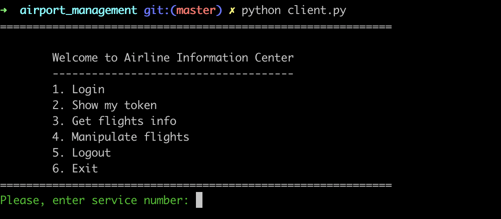
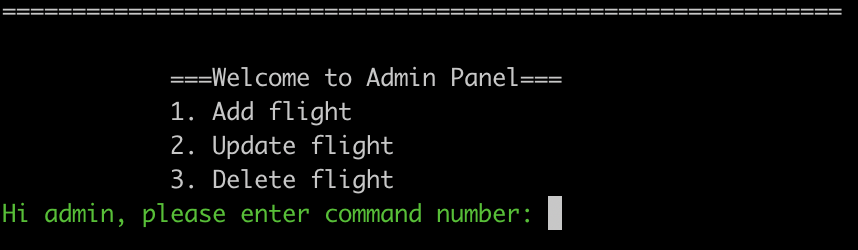

# Airport Management
## Description
This is CLI based simple client-server application built with Flask Restful and SQLite on Python. By using this software, users can get information about flights and admins can edit the database by adding new flights, updating and deleting currently available ones.

# Installation
Before everything, you need to have python3 installed on your workspace in order to properly run the program. You can check [Python](https://www.python.org/downloads/ "python.org") to install required version of python.

Run the following command to install this app:
```bash
    git clone https://github.com/MagsudMirzazada/Network_Programming/tree/master/airport_management.git
```
Next, install requirements to make sure all is ready for starting app:
```bash
    pip install -r requirements.txt
```
Now everything is ready to run the program.

# Usage
At least 2 terminals are required to use services.

Enter the following command into first terminal:
### Server
```bash
    python3 server.py
```
Enter the following command into second terminal:
### Client
```bash
    python3 client.py
```

After these, you will see following panel:



And panel will guide you from now on.

If you choose 4th service which is *Manipulate flights*, you will encounter another panel: 


In order to use these services, you need to authencticate yourself, login your credentials.

By default, there are two admin accounts:

|  Username  |  Password |
|  ----      |  -------- |
|  Magsud    |  Phoenix  |
|  admin     |  admin0   |